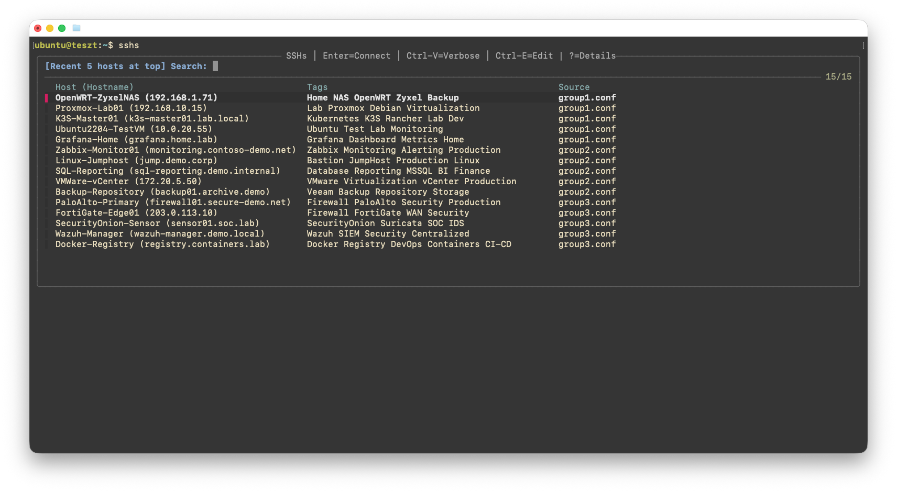
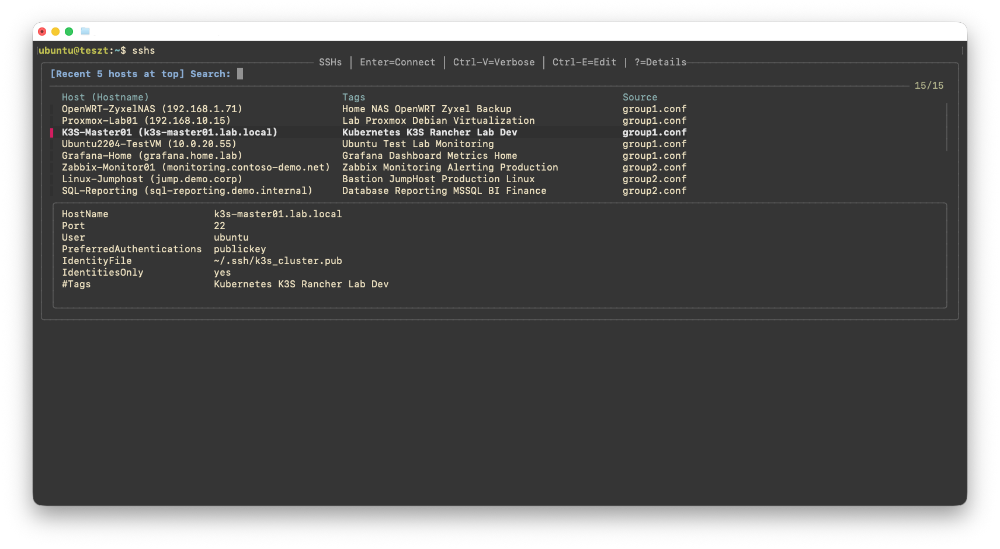

# SSHs – Interactive SSH Menu

SSHs is a lightweight shell tool that lets you browse and connect to SSH hosts using fzf. 
It was inspired by  [trzsz-ssh](https://github.com/trzsz/trzsz-ssh), but keeps things simple by using only:

- zsh/bash+awk or powershell
- fzf
- OpenSSH

No Go, no Python, no database.  
SSHs works directly with your existing OpenSSH configuration and remains fully compatible with native ssh.

SSHs is intentionally small.
The goal is not to replace SSH clients, terminal dashboards or inventory systems.
 
SSHs focuses on:
 
- simplicity and speed
- minimal dependencies
- native OpenSSH compatibility

while making large multi-group SSH configurations easier to navigate.

It is perfect for MSPs, consultants, homelabs and anyone managing dozens or hundreds of SSH hosts.


SSHs host list:  


SSHs host list with connection details preview:  



## What it does

SSHs parses your OpenSSH configuration and builds an interactive host picker in the terminal using fzf and AWK or Powershell on Windows and allows to search between them.  
It reads:
 
```shell
~/.ssh/config
~/.ssh/config.d/*.conf
```

and displays:

- Host name
- HostName / IP address
- Optional Tags
- Source configuration file  

Hosts can be organized across multiple customer or project configuration files while remaining fully compatible with native OpenSSH.

Select an entry to connect instantly, or press ? to display the host configuration preview.  

Tags are optional. If no # Tags line is present, the Tags column remains empty.


## Features
- Reads standard OpenSSH configuration
- Supports ~/.ssh/config.d/*.conf
- Fully compatible with native ssh
- Search by Host, HostName, Tags and Source file
- Preview selected host configuration
- Shows source configuration file
- Tracks and prioritizes the last 5 used hosts
- One-key editing of source config files in VS Code

## How It Works

SSHs builds a temporary merged configuration from: `~/.ssh/config` and `~/.ssh/config.d/*.conf` or `C:\Users\<user>\.ssh\config` and `C:\Users\<user>\.ssh\config.d\`

This allows:

- group-specific config files
- project-based separation
- native OpenSSH compatibility
- a single searchable host list

without maintaining multiple inventories.

## Requirements
- MacOS/Linux/Windows
- OpenSSH
- zsh
- awk (on MacOS/Linux)
- fzf
- Visual Studio Code (optional, for Ctrl+E)

## Directory Layout
SSH host definitions remain in the standard OpenSSH location:

```bash
~/.ssh/
├── config
└── config.d/
    ├── group1.conf
    ├── group2.conf
    ├── group3.conf
    ├── group4.conf
    └── ...
```

SSHs application files:
```bash
~/.config/sshs/
├── sshs.sh
├── sshs.awk
└── recent
```

## Example SSH configuration

Main SSH configuration (`~/.ssh/config` or `C:\Users\<user>\.ssh\config`):

```conf
Host *
	StrictHostKeyChecking accept-new

Include ~/.ssh/config.d/*.conf
```

Group-specific file(s) (`~/.ssh/config.d/group1.conf` or `C:\Users\<user>\.ssh\config.d\group1.conf`):

```conf
Host vm-1
	HostName 10.10.0.2
	Port 22
	User mynamedadmin
	PreferredAuthentications publickey
	IdentityFile ~/.ssh/1Password/SHA256_6mfGFxQoff_1f3jnbf_8A3+tCOCkvXzXasdddqZcu0+Bo.pub
	IdentityAgent "~/Library/Group Containers/2BUA8C4S2C.com.1password/t/agent.sock"
	IdentitiesOnly yes
	#Tags Group1 Prod HAProxy

Host vm-2
	HostName 172.21.254.123
	Port 22
	User administrator
	PreferredAuthentications password
	PubkeyAuthentication no
	#Tags Customer1 Lab fedora syslog-ng proxmoxvm

Host vm-3
	HostName 4.125.435.44
	Port 22
	User root
	PreferredAuthentications publickey
	IdentityFile ~/.ssh/mycert.pub
	IdentitiesOnly yes
	#Tags database mysql PROD
```

## Recent Hosts

SSHs automatically remembers the last 5 successfully selected hosts.  
The most recently used hosts are pinned to the top of the list for faster access.  
The recent host cache is stored in: `~/.config/sshs/recent`

## Installation and Usage

> [!IMPORTANT]
> SSHs relies on native OpenSSH configuration resolution.
> The main SSH configuration (`~/.ssh/config` or `%USERPROFILE%\.ssh\config` file must exist and contain:
> ```conf
> Include ~/.ssh/config.d/*.conf
> ```
> Without it, native commands such as: `ssh host-alias`will not work.

### One-line install

#### macOS/Linux

```bash
curl -fsSL https://raw.githubusercontent.com/sikkancs/sshs/main/sshs-install.sh | bash
```

Open a new Terminal window.

Start SSHs:

```shell
sshs
```

Show help
```shell
sshs -h
```


#### Windows

```powershell
irm "https://raw.githubusercontent.com/sikkancs/sshs/main/sshs-install.ps1" | iex
```
Open a new PowerShell or Windows Terminal window.

Start SSHs:

```powershell
sshs
```

Show help:

```powershell
sshs -Help
```


### Manual install

#### MacOS/Linux

Install fzf for your OS:
[fzf installation](https://github.com/junegunn/fzf#installation)

Create SSHs directory:

```shell
mkdir -p ~/.config/sshs
```

Copy files:

```shell
~/.config/sshs/
├── sshs.sh
└── sshs.awk
```
Make executable:

```shell
chmod +x ~/.config/sshs/sshs.sh
chmod +x ~/.config/sshs/sshs.awk
```

Add alias :

zsh:
```shell
echo 'alias sshs="$HOME/.config/sshs/sshs.sh"' >> ~/.zshrc
source ~/.zshrc
```

bash:
```bash
echo 'alias sshs="$HOME/.config/sshs/sshs.sh"' >> ~/.bashrc
source ~/.bashrc
```

Start SSHs:

```shell
sshs
```

Show help
```shell
sshs -h
```

#### Windows

Install fzf:

```powershell
winget install fzf
```

Create SSHs directory:

```powershell
New-Item `
    -ItemType Directory `
    -Path (Join-Path $HOME ".config\sshs") `
    -Force
```

Copy files:

```text
%USERPROFILE%\.config\sshs\
├── sshs-main.ps1
└── sshs.cmd
```

Add SSHs directory to your PATH:
 
1. Press Win + R
2. Type: `sysdm.cpl`
3. Open the **Advanced** tab
4. Click **Environment Variables**
5. Under **User variables**, select **Path**
6. Click **Edit**
7. Click **New**
8. Add: `%USERPROFILE%\.config\sshs`
9. Click **OK** on all dialogs

Open a new PowerShell or Windows Terminal window.

Verify installation:

```powershell
Get-Command sshs
```

Start SSHs:

```powershell
sshs
```

Show help:

```powershell
sshs -Help
```


## Key Bindings
| Key          | Action                                 |
| ------------ | -------------------------------------- |
| Enter        | Connect normally                       |
| Ctrl+V       | Connect using `ssh -vvvv`              |
| Ctrl+E       | Open the source config file in VS Code |
| ?            | Toggle configuration preview           |
| Esc / Ctrl+C | Exit                                   |

## Known Issues
- Very small terminal widths may break column alignment.
- Preview output is optimized for standard OpenSSH host definitions and may not perfectly display unusual multi-host patterns.
